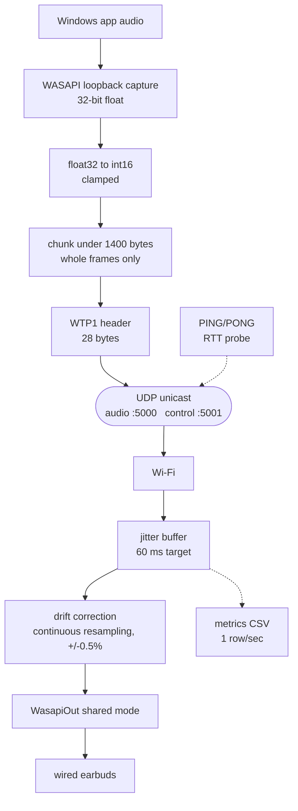

# Wired Tooth

Streams a Windows PC's system audio over local Wi-Fi so that **wired** earbuds
plugged into a phone can play it with far less delay than Bluetooth.

> **Status: v1.0 is not finished.** The Windows sender and receiver are
> complete and measured. The iOS app does not exist yet, and the stream has
> never been received by a device other than the PC that sent it. Every number
> below is a loopback number. See [Known limitations](#known-limitations) —
> they are stated up front rather than buried.

## The problem

Bluetooth audio is late. A2DP has to buffer, and the codec adds its own delay,
so a typical headset lands somewhere between 150 and 250 ms behind the video.
That is invisible for music and unusable for anything where you can see the
cause: lips move before the words, a gunshot arrives after the muzzle flash,
a key press sounds after you feel it.

Wired earbuds have none of that latency, but a phone's wired earbuds cannot
play a laptop's audio. Wired Tooth makes them: the PC captures its own output,
puts it on the network, and the phone plays it through the wire.

## Measured

Loopback only. The transport, the jitter buffer and the drift control loop are
real and measured; the network is not.

| | measured |
|---|---|
| Buffer depth, 27.8 min continuous | mean **61.08 ms** against a 60 ms target |
| Drift across that run | **+0.54 ms** (first-half mean 60.5, second-half 60.2) |
| Underruns | **0** |
| Packets lost | **0** of 251,487 |
| Estimated end-to-end | **~110 ms** (RTT/2 + buffer + output latency) |
| Median RTT | 0.52 ms loopback |
| Wire bitrate | 1,566 kbit/s (PCM16 48 kHz stereo + headers) |

**The ~110 ms figure is an estimate, not a measurement.** It assumes a
symmetric network path and uses the output latency the device was *asked* for
rather than what it delivered, and it excludes everything before the packet
leaves — WASAPI's own capture buffer, and the delay between an application
producing a sample and loopback handing it over. The honest number comes from
the acoustic method in [docs/MEASUREMENT.md](docs/MEASUREMENT.md), which has
not been performed. There is deliberately **no Bluetooth comparison table
here**, because doing that properly requires the acoustic measurement and a
Bluetooth headset, and inventing one would be the easiest lie in the project.

## Architecture



The control channel runs alongside the audio, not inside it: the receiver
initiates with `HELLO`, which is what lets a phone connect without the PC
knowing its address in advance — the client's address is learned from the
source of its own packet.

## How it works

### Capture

`WasapiLoopbackCapture` taps the default render endpoint, so whatever the PC
is playing is what gets captured, with no virtual cable or extra driver. It
delivers 32-bit float, which is converted to 16-bit PCM for the wire: half the
bandwidth, no audible loss, and directly playable by any receiver.

The conversion clamps before scaling. Loopback can hand back samples slightly
outside [-1, 1] when an application applies its own gain, and an unclamped cast
wraps a sample just over +1.0 into a large **negative** int16 — a full-scale
discontinuity, audible as a click on exactly the loudest passages.

WASAPI loopback also stops firing entirely when the PC is silent. It does not
deliver buffers of zeros; it simply stops. The sender emits silence-flagged
empty packets so the receiver's buffer and RTT tracking survive quiet passages.

### Transport

UDP unicast, never TCP. A retransmission that arrives 200 ms late is useless
for live audio — a lost 5 ms is better than a 200 ms freeze.

Packets are capped at 1400 bytes total, under the usual 1500-byte Wi-Fi MTU,
because a fragmented datagram loses the whole frame if any one fragment drops.
Payloads are always a whole number of frames: a datagram that split a frame
would leave the receiver permanently half a sample out of alignment, which
swaps left and right and sounds like noise.

The parser is total. Anything malformed is dropped and counted, never thrown
on — verified against 17 hand-written bad cases, all 11,220 single-byte
mutations of a valid packet, and 20,000 random datagrams, with zero exceptions.

Full wire format: [docs/PROTOCOL.md](docs/PROTOCOL.md).

### The drift-correction control loop

This is the part that makes it survive more than a few minutes.

The sender's sound card and the receiver's are never at exactly the same rate.
A few parts per million sounds like nothing, but at 48 kHz a 20 ppm difference
is about one sample per second — roughly 3.6 seconds of accumulated error per
hour. The buffer either drains to zero and clicks, or grows until latency is
unusable. It looks perfect for two minutes and fails at twenty.

The fix is not to resynchronise occasionally, because dropping or duplicating a
block of samples is audible. It is to run permanently slightly off-speed, by an
amount too small to hear, in whichever direction keeps the buffer level:

```
error  = bufferMs - 60ms            (positive = too full)
target = 1 + Kp * error             (>1 = play faster, drain)
ratio  = ratio + (target - ratio) * 0.1
```

Clamped to ±0.5%, about 8.7 cents of pitch. There is **no integral term**, on
purpose: the steady-state offset a proportional controller leaves behind *is*
the clock difference, and holding a small constant error is how the loop
expresses "run 12 ppm fast forever". An integrator would drive that error to
zero, wind up, and oscillate — audible as a slow pitch waver.

The ratio is applied by resampling incoming audio before it enters the buffer,
using linear interpolation with fractional phase carried across packet
boundaries. Resetting phase per packet would click 140 times a second.

## Build

Requires the **.NET 10 SDK on Windows**. Windows specifically, not just
Windows-preferred: capture is WASAPI loopback and playback is WASAPI shared
mode, and the tray app is WPF. There is no cross-platform build.

```
dotnet build WiredTooth.sln
```

That builds all six projects. NAudio and QRCoder restore from NuGet; nothing
else is needed for the applications themselves.

### Python tooling

The applications need no Python. The measurement and analysis tools do, and
they deliberately do not share one dependency list — the tool most likely to
run on a borrowed machine has no dependencies at all.

| Tool | Needs | Why |
|---|---|---|
| `MacReceiver/receiver_stats.py` | **nothing** — stdlib only | It runs on whatever second device you can find. Requiring `pip install` on a borrowed laptop is how a test does not get run. |
| `tools/plot_metrics.py` | `matplotlib` | Charts the metrics CSV. |
| `tools/acoustic.py` | `numpy` | FFT cross-correlation for the latency measurement. |

```
pip install numpy matplotlib
```

Python 3.9 or newer. Verified here on 3.14.3 with numpy 2.4.4 and matplotlib
3.11.1.

## Run

**Tray app** (the normal way):

```
dotnet run --project WiredTooth.Windows
```

Tray icon, right-click for status and a QR code encoding
`wiredtooth://<ip>:5000`. `--console` keeps the old console behaviour.

**Console sender and receiver** (the debugging path):

```
dotnet run --project NetworkTest
```

```
dotnet run --project NetworkClient
```

Start the receiver first — the sender does not transmit until a client says
`HELLO`. The receiver writes `metrics_<timestamp>.csv`, one row per second.

**Chart a run:**

```
python tools/plot_metrics.py metrics_20260911_110230.csv
```

**Statistics-only receiver**, for a second machine with no audio stack:

```
python3 MacReceiver/receiver_stats.py 192.168.1.42 --seconds 120
```

Reports loss, RTT median/p95/max, transit jitter and bitrate, and exits
non-zero if loss reaches 1%, so it can gate a script.

**Measure real latency acoustically.** Generate the click track, play it while
recording the room with one microphone, and analyse:

```
python tools/acoustic.py generate -o clicks.wav
```

```
python tools/acoustic.py measure recording.wav --reference reference.wav
```

Record the `--reference` pass first with the earbud silent. A click reflecting
off a desk lands 5-15 ms behind the direct sound, which is the same range as a
good result, so without it a reflection cannot be told from the earbud — and
the tool will refuse to answer rather than guess. Verify the analyser against
known delays with `python tools/acoustic.py selftest`. Full procedure and the
three configurations to compare: [tools/benchmark.md](tools/benchmark.md).

**Diagnostics.** `AudioInspect` prints the capture format and raw sample values
— the first thing to run when audio sounds wrong. `NetworkTest --waveout`
selects the old WinMM output backend, which reproduces the 16.7% drain
described in [docs/ENGINEERING_NOTES.md](docs/ENGINEERING_NOTES.md).

## Known limitations

- **Never tested over real Wi-Fi.** Every number here is loopback. Loopback
  does not drop, reorder, fragment, or vary in delay. The QR pairing, the
  handshake and the address picker all work, but nothing has ever received
  this stream except the PC that sent it.
- **No iOS app.** The receiver is Windows-only. iOS needs a Mac with Xcode;
  the routing research is in [docs/IOS_AUDIO.md](docs/IOS_AUDIO.md).
- **No acoustic latency measurement**, so the headline number is an estimate
  and there is no Bluetooth comparison.
- **Uncompressed.** 1,566 kbit/s per client. Fine on a hotspot, wasteful in
  general. The `codec` header field exists so Opus can be added without
  breaking compatibility; it is 0 and unused.
- **No encryption or authentication.** Anything on the network that sends a
  valid `HELLO` receives the stream.
- **The tray status window cannot show latency, loss or buffer depth.** Those
  are measured at the receiver, and WTP1 has no packet type to report them
  back. The window says so rather than displaying zeros.
- **IPv4 only.**

## What I'd do next

1. **The acoustic measurement.** Everything else is guesswork until the number
   includes the parts no API reports. The tooling is written and self-tested
   ([tools/benchmark.md](tools/benchmark.md)); it needs a microphone, the
   earbuds, and a Bluetooth headset to compare against.
2. **The iOS receiver**, which is also the only thing that proves the Wi-Fi
   path works at all.
3. **A `STATS` control packet**, so the sender can display what the receiver
   measures instead of pointing at another terminal.
4. **Opus**, once there is a real network to justify it.

## Repository

| Path | Role |
|---|---|
| `WiredTooth.Protocol/` | WTP1 wire format. Shared, and mirrored by the Python receiver. |
| `WiredTooth.Sender/` | The sender: capture, packetisation, control channel, device handling. |
| `WiredTooth.Windows/` | WPF tray app, status window, QR pairing. |
| `NetworkClient/` | Console front-end over the same sender. Debugging and regression. |
| `NetworkTest/` | Windows receiver: jitter buffer, drift correction, metrics. |
| `AudioInspect/` | Capture-format diagnostic. |
| `MacReceiver/` | Stdlib Python statistics receiver for a second machine. |
| `tools/` | `plot_metrics.py` charts a run; `acoustic.py` measures real latency. |
| `docs/` | Protocol, measurement method, iOS routing, engineering notes. |
