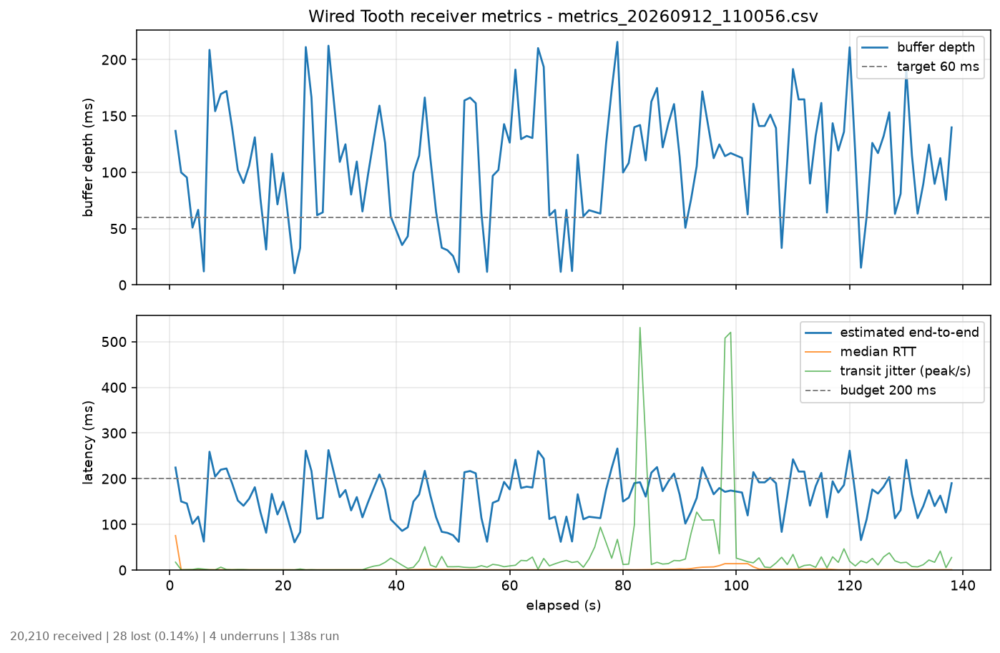
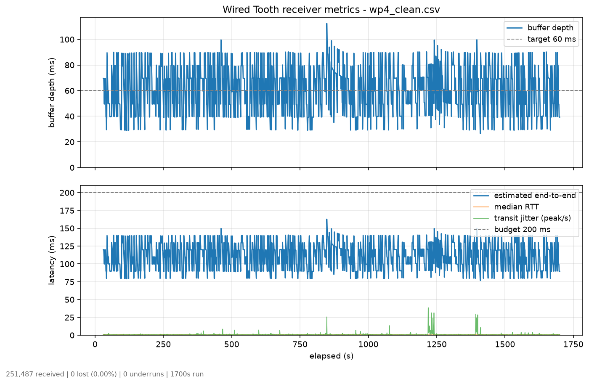

# Engineering notes

The three problems that actually cost time, what was tried, and what worked.

A note on which three. `BUILD_PLAN.md` predicted they would be clock drift,
iOS local-network restrictions, and WASAPI silence gaps. Two of those were
real. The iOS one never happened, because the iOS app does not exist yet — the
research is in [IOS_AUDIO.md](IOS_AUDIO.md) and is honestly labelled as
research. Its place on this list was taken by something nobody predicted: the
output device.

---

## 1. The output device was 16.7% slow, and it looked exactly like clock drift

**Symptom.** The jitter buffer filled to its 500 ms ceiling within three
seconds and stayed there, whatever the drift controller commanded. Latency was
500 ms against a 200 ms budget. The correction ratio sat pinned at its +0.5%
clamp, permanently asking for maximum drain and never getting anywhere.

**What it looked like.** Textbook clock drift, just faster than expected. The
whole of WP4 exists to fix exactly this failure, so the obvious conclusion was
that the controller was wrong.

**Three hypotheses, all wrong.**

1. *A startup burst overfilled the buffer and the ±0.5% clamp is too slow to
   recover it.* Plausible: at a net drain of 0.17%/s, clawing back 450 ms takes
   over four minutes. Added a resync guard to discard the excess in one step.
   The buffer still would not hold.
2. *The silence keepalive is inflating the stream.* Each empty silence packet
   expands to a fixed 100 ms at the receiver, so if they arrived faster than
   every 100 ms, or interleaved with real audio, the receiver would be
   manufacturing audio out of nothing. This was a good theory with a clear
   mechanism.
3. *The sender is over-producing.* Byte-level accounting said +0.33% — within
   the clamp. So the sender was exonerated but nothing replaced it.

**What actually found it.** Instrumentation, not thinking. Every frame entering
the buffer was attributed to exactly one source:

```
Arrived (payload): 6,287,040   47,993/s   -0.01% vs real time
  + from audio   : 5,198,911
  + from silence :     4,800   (1 packet)
  + concealment  :         0
  - resync drop  : 1,074,244
ADDED to buffer  : 5,203,711   39,723/s  -17.24% vs real time
Consumed (implied):            39,674/s
```

One run. The sender was −0.01% — essentially perfect. Silence contributed 4,800
frames out of 6.3 million, which killed hypothesis 2 outright. Concealment
contributed nothing. And the consumer was pulling 39,674 frames/s from a 48,000
Hz stream.

That pointed away from the network entirely, so the next test removed the
network:

| output API | frames/s | vs 48,000 |
|---|---|---|
| `WaveOutEvent` (WinMM) | 39,977 | **−16.72%** |
| `WasapiOut` (shared) | 48,219 | **+0.46%** |

Same machine, same device, same format, no sockets involved. The default render
endpoint is a virtual device — FxSound Audio Enhancer — and WinMM drains it 16.7%
slower than real time. No drift controller can close a 16.7% gap, because the
clamp is ±0.5% *by design*: corrections larger than that are audible, which
defeats the purpose.

**What worked.** Switching the receiver's playback to `WasapiOut` shared mode.
The residual +0.46% is ordinary clock difference, which is precisely what the
controller is for.

**Reproduce it.** `NetworkTest --waveout` selects the old backend.

Before, WinMM — buffer mean 110.8 ms, sd 50.5, and it is now *losing packets
and underrunning* because the resync guard is throwing audio away to compensate:



After, WASAPI — mean 61.08 ms against a 60 ms target, 0 lost, 0 underruns:



**The lesson.** Every symptom pointed at the sender or the buffer, because
those are the parts this project wrote. The bug was in the part it merely
called. Three hypotheses were burned before measuring; the measurement settled
it in one run. Build the accounting first.

---

## 2. Clock drift, and why the controller has no integral term

**The problem.** Two sound cards are never at exactly the same rate. At 48 kHz
a 20 ppm difference is about one sample per second, ~3.6 seconds of error per
hour. The buffer drains to zero and clicks, or grows until latency is unusable.
It looks perfect for two minutes and fails at twenty — which is why the
acceptance test is 30 minutes and not 30 seconds.

**What does not work.** Resynchronising when the error gets large: dropping or
duplicating a block of samples is audible every time it happens. That is fine
as a guard against transients, and it is kept for exactly that, but it cannot
be the steady-state mechanism.

**What works.** Run permanently slightly off-speed, by an amount too small to
hear, in whichever direction keeps the buffer level. A proportional controller
on buffer depth, clamped to ±0.5% — about 8.7 cents — applied by resampling
incoming audio before it enters the buffer.

**Why no integral term.** This is the part worth explaining. A textbook PI
controller drives steady-state error to zero, and that is wrong here. The
steady-state offset a P controller settles at *is* the clock difference: it is
the loop saying "run 12 ppm fast, forever". Adding an integrator makes it chase
that offset to zero, wind up, and oscillate around the setpoint — which is
audible as a slow pitch waver. The residual error is not a defect to be
eliminated; it is the measurement.

**Resampler choice.** Linear interpolation, not NAudio's
`WdlResamplingSampleProvider`. WDL is a windowed-sinc resampler and the better
tool for real rate conversion — 44.1k to 48k — but it holds filter state tied
to a fixed input/output rate pair, and this ratio changes every 100 ms.
Reconfiguring it that often either discards filter state or is unsupported. At
±0.5% every output sample falls between two input samples that are essentially
the same point in the waveform, so the interpolation error is far below the
16-bit noise floor. The stopband quality that justifies WDL's complexity is
irrelevant when barely resampling at all.

What *does* matter is phase continuity. Fractional position and the final frame
carry across calls, so a packet boundary is not a discontinuity. Resetting per
packet would click 140 times a second.

**Result.** 27.8 minutes continuous: mean 61.08 ms against a 60 ms target,
drift +0.54 ms first-half to second-half, 0 underruns, 0 lost of 251,487.

**The acceptance criterion was wrong, and was changed.** It originally required
*instantaneous* depth within ±10 ms. Measured depth oscillates ±18 ms, so only
33% of one-second samples qualified — while the mean sat on target and the
trend was flat. That residual is packet **arrival jitter**, and absorbing it is
the jitter buffer's entire purpose. Tightening the controller to chase it would
convert a buffering problem into an audible one, since the correction is
applied as playback speed: reacting to jitter means modulating pitch at the
jitter frequency. The same paragraph already demanded a slow controller that
does not oscillate, so the clause was in tension with itself. It now reads
"mean within ±10 ms with no measurable trend", which is what it was testing for
all along.

---

## 3. The measurements were lying, twice

Both of these were found by running the failure case rather than by reading the
code, and both had been quietly reporting success.

### Underruns read zero during a total outage

The underrun check lived in the packet-receive loop:

```csharp
if (playbackStarted && buffer.BufferedBytes == 0)
    underruns++;
```

It only runs when a packet arrives. During a network drop — the one case
guaranteed to starve playback — no packets arrive, so the check never executes.
A deliberate 20-second outage reported **0 underruns** while the buffer sat
empty the entire time.

Moved into the 100 ms control loop, which runs regardless of traffic. The same
20-second gap now reports **264**.

A metric that reads zero when things are working and *also* reads zero when
things are catastrophically broken is worse than no metric, because it is
quoted with confidence.

### Two readers on a single-consumer buffer

The first resync guard drained the excess by calling `buffer.Read()` from the
control-loop thread — while `WasapiOut`'s playback thread was reading the same
`BufferedWaveProvider`. NAudio's circular buffer supports one producer and one
consumer; a second reader corrupts its internal state.

Symptom: 182 resyncs in 190 seconds and a buffer that never settled, which
looked like the controller oscillating.

Fixed by draining differently — the receive thread stops *adding* until depth
returns to target, so the buffer keeps exactly one writer and one reader.

---

## 4. WASAPI loopback stops when the PC is silent

Predicted, and real, but much less trouble than the above.

`WasapiLoopbackCapture` does not deliver buffers of zeros during silence — it
stops firing `DataAvailable` entirely. Left alone, the receiver's buffer drains
to empty during any quiet passage, underruns, and has to refill from scratch
when audio returns.

The sender emits a silence-flagged AUDIO packet with an empty payload every
100 ms of quiet. The receiver expands each into 100 ms of silence. The duration
cannot be derived from the packet — the payload is empty by design, to avoid
sending kilobytes of zeros — so it is a shared constant,
`WtpPacket.SilenceKeepaliveMs`, and both implementations must agree on it.

It is also, incidentally, the reason hypothesis 2 above was plausible: a
mechanism that manufactures audio out of nothing is exactly the kind of thing
that inflates a stream. It was not doing so, but it was worth checking.

---

## What this cost

WP4 — one work package on paper — took three wrong hypotheses, a rewritten
resync guard, two corrected metrics, and an output-backend change to complete.
The productive move in every case was the same: stop reasoning about the code
and measure where the bytes actually go.

The instrumentation that found it is still in the receiver and prints on exit.
It costs nothing at runtime and it is the reason the next unexplained number
will take one run instead of an afternoon.
